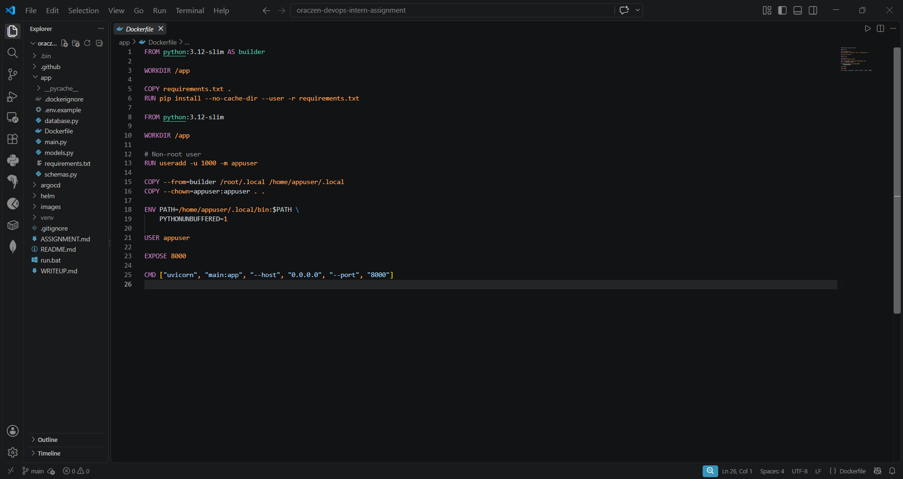
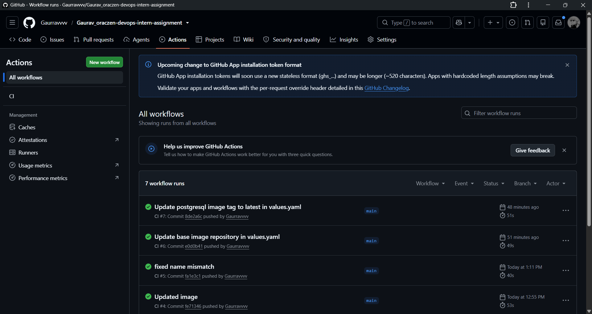
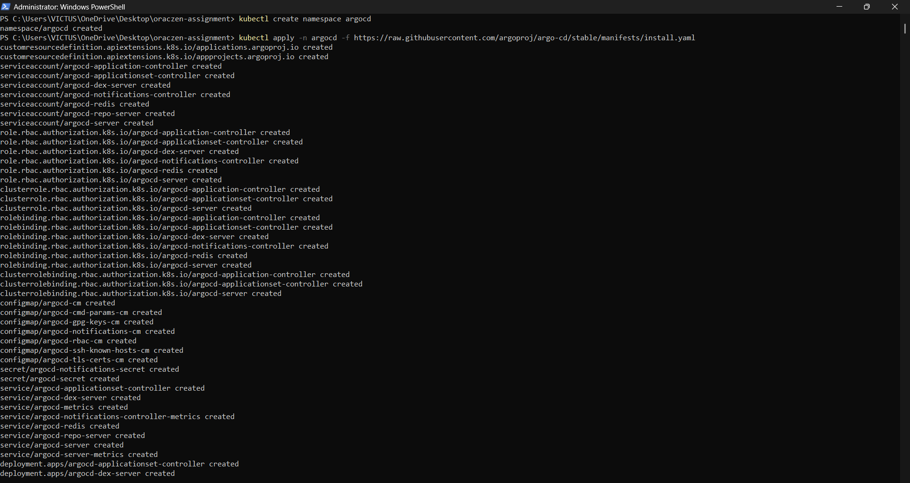
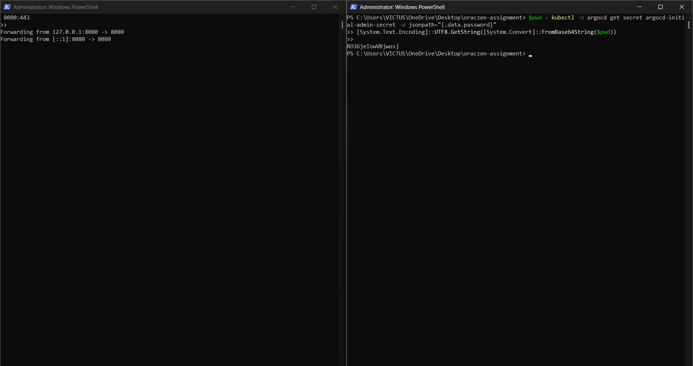
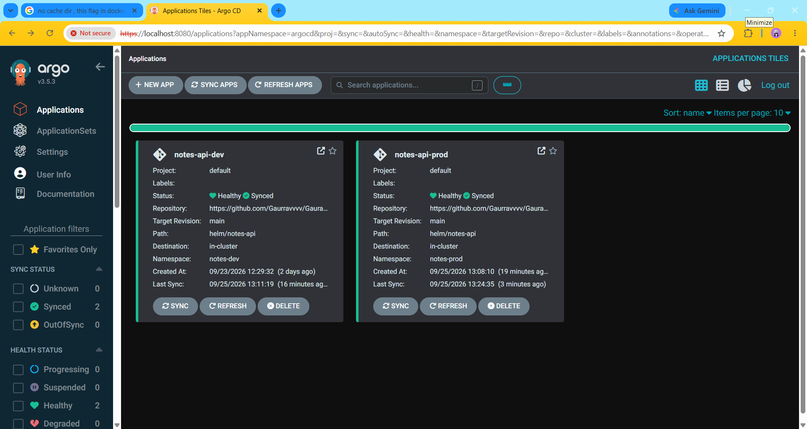
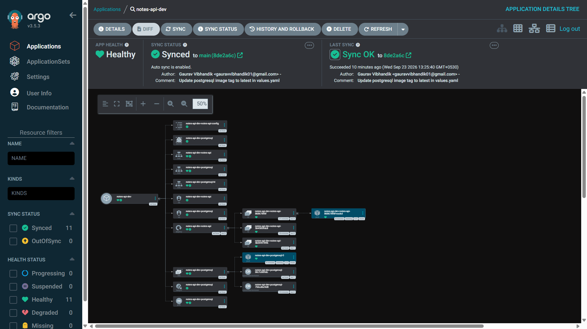
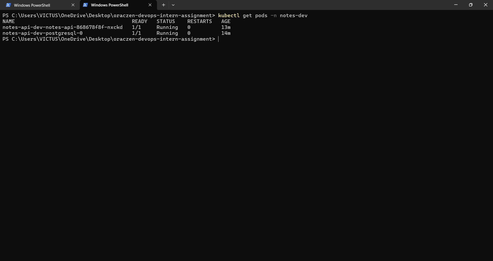
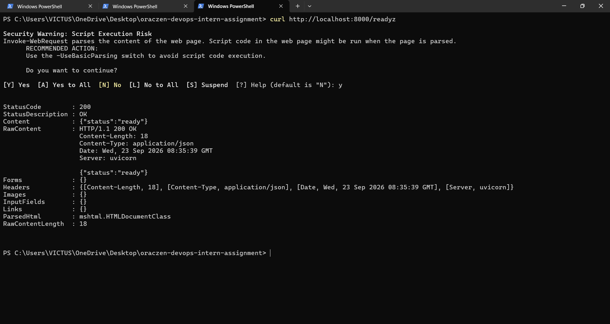
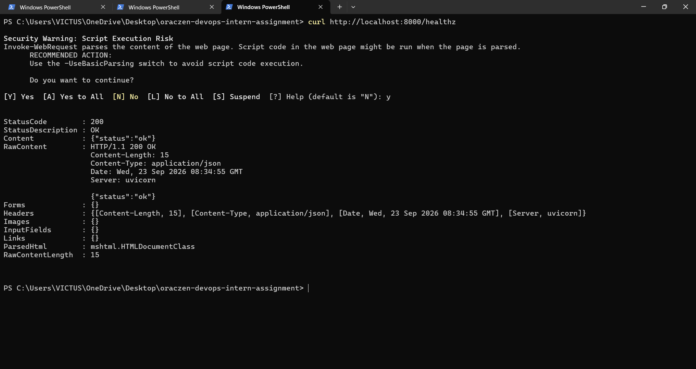

# Notes API — DevOps Submission Write-Up

**Author:** Gaurav Vibhandik  
**LinkedIn:** [linkedin.com/in/gaurravvvv](https://www.linkedin.com/in/gaurravvvv/) | **LeetCode:** [leetcode.com/u/bis9NoCqXN](https://leetcode.com/u/bis9NoCqXN/)

Technical documentation covering containerization, Helm packaging with PostgreSQL subchart dependency, CI workflow with security gates, ArgoCD GitOps deployment, and production considerations.

---

## Tech Stack

- **FastAPI (Python 3.12)** — Backend application
- **Docker** — Multi-stage containerization
- **Helm v3** — Kubernetes packaging
- **Kind** — Local Kubernetes cluster
- **GitHub Actions** — CI pipeline
- **Trivy** — Vulnerability & IaC security scanning
- **GHCR** — Container registry
- **ArgoCD** — GitOps deployment

---

## Local Tooling Setup (`.bin`)

To ensure a self-contained local developer experience without altering global system binaries, local versions of `kind` and `helm` were placed in a `.bin/` directory:

```bash
# 1. Create local binary directory
mkdir .bin

# 2. Download Kind (Windows)
curl -Lo .bin/kind.exe https://kind.sigs.k8s.io/dl/v0.24.0/kind-windows-amd64.exe

# 3. Download Helm (Windows)
# Download from https://get.helm.sh or winget install Helm.Helm and place helm.exe into .bin/

# 4. Add .bin to current session PATH
$env:PATH = "$PWD\.bin;" + $env:PATH    # PowerShell
# set PATH=%CD%\.bin;%PATH%             # CMD

# 5. Verify local tooling
kind version
helm version
```

---

## Part 1 — Containerize the App

### Dockerfile & Image Build



```dockerfile
# Stage 1: Build dependencies
FROM python:3.12-slim AS builder
WORKDIR /app

# Cache dependencies layer
COPY requirements.txt .
RUN pip install --no-cache-dir --user -r requirements.txt

# Stage 2: Minimal runtime
FROM python:3.12-slim
WORKDIR /app

# Non-root user (UID 1000)
RUN useradd -u 1000 -m appuser

# Copy only installed packages and application code
COPY --from=builder /root/.local /home/appuser/.local
COPY --chown=appuser:appuser . .

ENV PATH=/home/appuser/.local/bin:$PATH \
    PYTHONUNBUFFERED=1

USER appuser
EXPOSE 8000
CMD ["uvicorn", "main:app", "--host", "0.0.0.0", "--port", "8000"]
```

### `.dockerignore`
Excludes `.venv`, `__pycache__`, `.git`, `.env`, and test caches to minimize build context upload speed and prevent credential leakage.

### Decisions & Trade-offs
- **Multi-stage build:** Separates build tools from runtime, keeping the final image lean (205 MB) and reducing attack surface.
- **Non-root user (`appuser`, UID 1000):** Adheres to least privilege and prevents container breakout risks; fulfills Kubernetes `runAsNonRoot` policies.
- **Debian-slim vs. Alpine:** Chose `python:3.12-slim` over Alpine because packages with C-extensions (`psycopg2-binary`) frequently suffer compatibility issues with Alpine's `musl libc`.
- **Probes vs. Docker HEALTHCHECK:** Kubernetes kubelet ignores Docker's `HEALTHCHECK`. Kubernetes native probes cleanly separate liveness (`/healthz` to restart hung processes) from readiness (`/readyz` to stop routing traffic during database restarts).

### Verification
```bash
docker build -t notes-api:local app
docker images notes-api:local                     # 205MB
docker run --rm notes-api:local whoami            # appuser (UID 1000)
```

---

## Part 2 — Helm Chart with Database Dependency

### Chart Structure
Under `helm/notes-api/`:
- `Chart.yaml`: Declares PostgreSQL (v15.5.37) as an OCI subchart dependency.
- `templates/`: `deployment.yaml`, `service.yaml`, `configmap.yaml`, `serviceaccount.yaml`, `hpa.yaml`, and `NOTES.txt`.
- Environment configs: `values.yaml` (base), `values-dev.yaml` (dev), and `values-prod.yaml` (prod).

### PostgreSQL Subchart Secret Wiring (Part 2, Point 3)
*(Referencing the subchart's generated Secret instead of duplicating passwords in values.yaml)*

The PostgreSQL subchart automatically creates a Secret `<release-name>-postgresql` containing the DB password. The app reads this password directly via `secretKeyRef` rather than duplicating credentials in `values.yaml`:

```yaml
env:
  - name: POSTGRES_PASSWORD
    valueFrom:
      secretKeyRef:
        name: {{ .Release.Name }}-postgresql
        key: password
```

Non-sensitive connection settings (`POSTGRES_HOST`, `POSTGRES_PORT`, `POSTGRES_DB`, `POSTGRES_USER`) are loaded via ConfigMap:

```yaml
envFrom:
  - configMapRef:
      name: {{ .Release.Name }}-notes-api-config
```

### Environment Overrides (`values-dev.yaml` vs. `values-prod.yaml`)

| Setting | `values-dev.yaml` | `values-prod.yaml` | Rationale |
|---|---|---|---|
| `replicaCount` | `1` | `3` | Dev saves resources; Prod ensures high availability. |
| `image.tag` | `latest` | `1.0.0` | Dev uses latest build; Prod uses immutable release tag. |
| `image.pullPolicy` | `Always` | `Always` | Ensures current image is fetched across environments. |
| `resources` | Low (`50m` CPU / `64Mi` RAM) | Higher (`250m` CPU / `256Mi` RAM) | Sized according to workload expectations. |
| `persistence` | `enabled: false` | `enabled: true` (10Gi) | Dev DB is ephemeral; Prod DB requires durable disk. |
| `autoscaling` | `enabled: false` | `enabled: true` (3-10 replicas) | Prod scales under traffic spikes. |

### Verification
```bash
helm dependency build helm/notes-api
helm lint helm/notes-api
helm template notes-dev helm/notes-api -f helm/notes-api/values-dev.yaml
helm template notes-prod helm/notes-api -f helm/notes-api/values-prod.yaml
```

---

## Part 3 — CI Pipeline (GitHub Actions)

### Workflow Overview (`.github/workflows/ci.yaml`)
The pipeline runs on every pull request and push to `main`, split into three fast, modular jobs:
1. **`lint`**: Code quality and syntax validation using Ruff.
2. **`docker-build-scan`**: Container build, Trivy vulnerability scanning with a blocking severity gate, and automated publishing to GHCR.
3. **`helm-lint-scan`**: Helm packaging validation, chart linting, and Trivy IaC misconfiguration scanning.

---

### Key Workflow Snippets & Explanations

#### 1. Python Linting with Ruff
```yaml
- name: Lint with Ruff
  run: ruff check app/ --ignore B008,F401,I001,UP045
```
Fast Python linter checking syntax, code hygiene, and errors in `app/`. Ignored rules account for standard FastAPI patterns (such as `Depends` inside function default arguments).

#### 2. Trivy Container Image Scan (Strict Severity Gate)
```yaml
- name: Run Trivy vulnerability scan
  uses: aquasecurity/trivy-action@master
  with:
    image-ref: ${{ env.IMAGE_NAME }}:${{ github.sha }}
    format: 'table'
    exit-code: '1'
    ignore-unfixed: true
    severity: 'CRITICAL,HIGH'
```
Scans the built container image filesystem for known CVEs. The `exit-code: '1'` enforces a strict blocking gate: any unpatched `CRITICAL` or `HIGH` vulnerabilities immediately fail the CI build before the image can be published.

#### 3. Automated Container Registry Push (GHCR)
```yaml
- name: Log in to GitHub Container Registry
  if: github.ref == 'refs/heads/main'
  uses: docker/login-action@v3
  with:
    registry: ghcr.io
    username: ${{ github.actor }}
    password: ${{ secrets.GITHUB_TOKEN }}

- name: Push Docker image to GHCR
  if: github.ref == 'refs/heads/main'
  run: |
    docker push ${{ env.IMAGE_NAME }}:${{ github.sha }}
    docker push ${{ env.IMAGE_NAME }}:latest
```
On merges to `main`, authenticates keylessly using the built-in `GITHUB_TOKEN` and publishes both the immutable commit SHA tag and `latest` to GitHub Container Registry (GHCR).

#### 4. Helm Linting & Trivy IaC Configuration Scan
```yaml
- name: Build dependencies & lint chart
  run: |
    helm dependency build helm/notes-api
    helm lint helm/notes-api

- name: Render manifests & run Trivy config scan
  run: |
    helm template helm/notes-api -f helm/notes-api/values-prod.yaml > rendered.yaml

- name: Run Trivy config scan
  uses: aquasecurity/trivy-action@master
  with:
    scan-type: 'config'
    scan-ref: 'rendered.yaml'
    format: 'table'
    exit-code: '1'
    severity: 'CRITICAL,HIGH'
```
Validates Helm chart syntax and dependencies, renders Kubernetes manifests using `values-prod.yaml`, and executes Trivy in `config` mode with a strict `exit-code: '1'` severity gate to block any infrastructure-as-code misconfigurations (such as root containers, privilege escalation, or missing resource limits).

---

### Decisions & Trade-offs
- **Strict Severity Gates Across Image and IaC (`exit-code: 1`):** Both the container vulnerability scan and the Helm IaC config scan enforce an immediate pipeline failure on `CRITICAL,HIGH` findings. This ensures zero unvetted security misconfigurations reach the cluster or registry. For container CVEs, this is paired with `ignore-unfixed: true` to prevent blocking on upstream vulnerabilities that lack a vendor patch.
- **Three Independent Parallel Jobs:** Splitting the pipeline into `lint`, `docker-build-scan`, and `helm-lint-scan` speeds up execution by parallelizing checks and provides clear, immediate feedback on where a failure occurred without digging into long unified logs.
- **Automated GHCR Push on Main:** Pushing to GHCR was optional in the assignment, but wiring it up with `${{ secrets.GITHUB_TOKEN }}` ensures that the GitOps controller (ArgoCD) always pulls verified, scanned images.

---

### CI Verification
All three jobs pass cleanly on pull requests and pushes to `main`:



---

## Part 4 — GitOps with ArgoCD

### Application Setup
- `argocd/notes-api-dev.yaml`: Deploys to `notes-dev` namespace using `values-dev.yaml`.
- `argocd/notes-api-prod.yaml`: Deploys to `notes-prod` namespace using `values-prod.yaml`.

### Sync Policies: Dev vs. Prod
- **Dev (`prune: true, selfHeal: true`)**: Pruning automatically cleans up discarded resources for rapid iteration.
- **Prod (`prune: false, selfHeal: true`)**: Pruning is disabled to prevent accidental cascade-deletions of persistent volumes or secrets. `selfHeal` reverts any manual cluster drift back to Git.

### Question 1: If someone edits `values-prod.yaml` and merges it to `main`, what is the sequence of events from that merge to the new pod running?

1. **Git Commit Merged:** Developer merges an update to `values-prod.yaml` into the `main` branch.
2. **ArgoCD Detection:** ArgoCD detects the new commit SHA and marks the application `OutOfSync`.
3. **Manifest Reconciliation:** ArgoCD renders the Helm chart using the updated `values-prod.yaml` and applies the changes to the Kubernetes API server.
4. **Rolling Update Triggered:** The Deployment controller detects the updated spec and initiates a rolling update by spinning up a new `ReplicaSet`.
5. **Scheduling & Probes:** Kubelet schedules and starts the new container, polling `/readyz` for database connectivity.
6. **Traffic Cutover:** Once `/readyz` returns HTTP 200, the pod is marked `Ready`, the Service switches traffic to the new pod, and the old pod is gracefully terminated.
7. **Healthy State:** ArgoCD observes all resources in a healthy state and marks the app `Synced` and `Healthy`.

### Question 2: Where to Look if It Didn't Roll Out

1. **ArgoCD Application Status (`argocd app get notes-api-prod` or UI):**
   - Check if the application is `OutOfSync`, `Degraded`, or stuck in `Progressing`. Look for Helm template rendering errors or Git repository access issues.
2. **Deployment Events (`kubectl describe deployment notes-prod-notes-api -n notes-prod`):**
   - Check events for resource quota limits, ReplicaSet creation errors, or admission webhook rejections.
3. **Pod Lifecycle & Logs (`kubectl get pods -n notes-prod` & `kubectl describe pod <pod>`):**
   - **`ImagePullBackOff`:** Image tag does not exist in GHCR or registry credentials are missing.
   - **`CrashLoopBackOff`:** Container exited on startup. Check container logs with `kubectl logs <pod> -n notes-prod --previous`.
   - **`0/1 Running` (Readiness Failure):** Pod started but fails `/readyz`. Check database connectivity or verify if `POSTGRES_PASSWORD` in the secret matches PostgreSQL.

### Verification (Local Kind Cluster)

#### 1. Cluster & ArgoCD Setup
- Multi-node Kind cluster initialized:
  

- ArgoCD services deployed:
  

- Port-forwarding ArgoCD and retrieving admin credentials:
  

#### 2. GitOps Sync & Topology
- `notes-api-dev` Synced and Healthy in ArgoCD UI:
  

- Full Kubernetes resource tree (Deployment, Service, ConfigMap, PostgreSQL subchart):
  

#### 3. Pod Health & API Verification
- All pods `1/1 Running`:
  

- Readiness probe (`/readyz`) HTTP 200 with database connected:
  

- Full CRUD testing (`POST /notes`, `GET /notes`) verifying data persistence:
  

---

## Part 5 — Optional

1. **Secrets Management (External Secrets Operator + AWS Secrets Manager):**
   - Store DB credentials in AWS Secrets Manager instead of Git.
   - ESO synchronizes secrets to Kubernetes using IAM Roles for Service Accounts (IRSA); the Helm chart reads them unchanged via `secretKeyRef`.
2. **Monitoring & Observability:**
   - Add Prometheus scrape annotations (`prometheus.io/scrape: "true"`).
   - Set up Prometheus alerts for elevated 5xx error rate (>5%), readiness probe flapping, and high p95 latency (>500ms).
3. **Autoscaling (HPA):**
   - Configured in `templates/hpa.yaml` (3-10 replicas targeting 75% CPU utilization in `values-prod.yaml`).
4. **Supply Chain Security:**
   - Generate CycloneDX SBOMs via Trivy during CI.
   - Sign container image digests with `cosign` using keyless GitHub OIDC.
